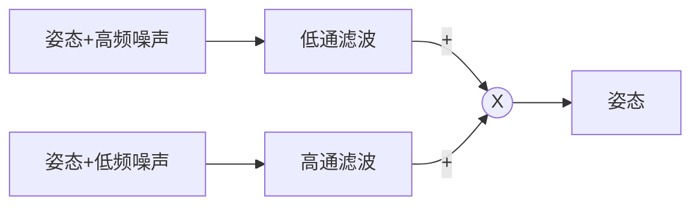
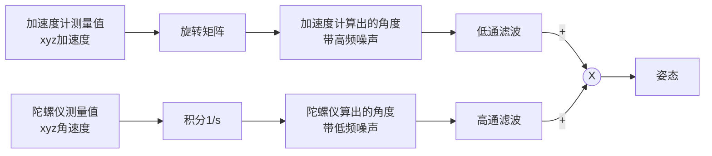
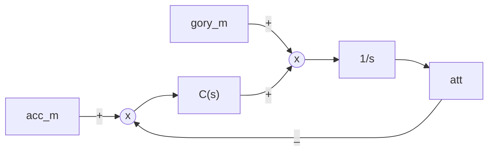
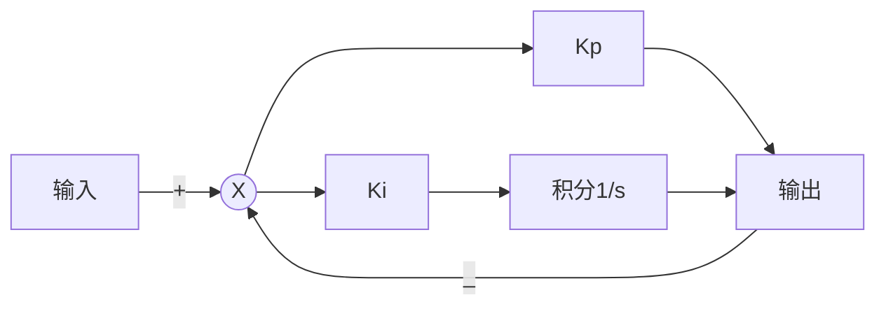
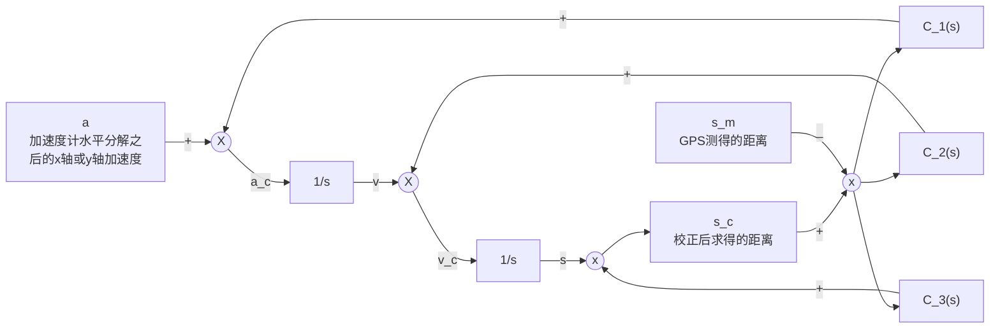

# 互补滤波深层原理

这篇笔记主要解释互补滤波里面所谓的$K_P$和$K_I$实际上是怎么来的，由此深入说明三阶互补滤波的原理。

互补滤波的原理其实非常简单，假设我有两路信号，一个带有高频噪声，一个带有低频噪声，所以我把他们的噪声分别滤除，然后合并，就得到了没有噪声的原始信号。

流程图1

但是很明显，Mahony的叉积法互补滤波程序和上面的流程图出入很大，因为这个流程图介绍的是**传统的线性互补滤波(Classical Complementary Filters)**，而Mahony用来算解姿态的滤波是经过改进的非线性互补滤波，非线性互补滤波里有两种形式：**直接互补滤波(Direct complementary filter)**和**无源互补滤波(Passive complementary filter)**，网上看到的开源代码都是基于无源互补滤波器的显式误差版本：**显式互补滤波器(Explicit complementary filter)**。

## 先从传感器开始说起

有两路姿态，一个带有高频噪声，一个带有低频噪声，所以我把他们的噪声分别滤除，然后合并，就得到了没有噪声的姿态信息。下面我默认大家都懂怎么用加速度计和陀螺仪分别求出姿态角，直接给出流程图。

流程图2

## 从低通滤波器开始分析

低通滤波器是我们比较熟悉的，之前我们分析过一阶低通滤波器，但是低通滤波器有很多种，为了讨论不同的状态，令低通滤波器函数为LPF。

那高通滤波器是什么呢？这里我们的低通滤波和高通滤波合并后希望能够通过完整的波形，也就是波形完全不变，那这个全通的函数其实就是1，所以我们高通滤波器就可以设计为1-LPF。

以我们最熟悉的一阶低通滤波器为例，它的函数为：

$$\Large LPF=\frac{1}{\frac{s}{\omega_c}+1}$$

那高通滤波就是：

$$\Large HPF=1-LPF=1-\frac{1}{\frac{s}{\omega_c}+1}=\frac{\frac{s}{\omega_c}}{\frac{s}{\omega_c}+1}$$

我们再试试二阶滤波器，二阶低通滤波器函数为：

$$\Large LPF=\frac{a_2s+a_3}{b_1s^2+b_2s+b_3}$$

二阶高通滤波器为：

$$\Large HPF=1-LPF=\frac{a_1s^2}{b_1s^2+b_2s+b_3}$$

所以，可以看见很过论文把这个过程进行了总结，给出了通用的低通滤波函数：

$$\Large LPF=\frac{C(s)}{C(s)+s}$$
$$\Large HPF=1-LPF=\frac{s}{C(s)+s}$$

当$C(s) = c$时，对应的就是一阶滤波器。

当$C(s) = a+ b/s$时，对应的就是二阶滤波器 。

我们将低通滤波器和高通滤波器的一般形式放入我们的公式：

$$\Large 
att=acc_m*LPF+gory_m*\frac{1}{s}*HPF\\
=acc_m*\frac{C(s)}{C(s)+s}+gory_m*\frac{1}{s}*\frac{s}{C(s)+s}\\
=\frac{acc_m*C(s)+gory_m}{C(s)+s}
$$
若上式要转换成流程框图，显然分母形式与我们平日所见的稍有不同，因此进行处理：
$$\Large 
att=\frac{acc_m*\frac{C(s)}{s}+gory_m*\frac{1}{s}}{\frac{C(s)}{s}+1}
$$
画出流程图：

流程图3

二阶的这个形式**正好和$K_P$，$K_I$形式一致**，很多地方都会强调这里的KP，Ki有什么做用，又是消除误差，又是调整截止频率，但是我认为在线性互补滤波器中，这里的参数的作用就是构成二阶滤波器，这里的参数也仅仅是二阶滤波器的参数。

## 和PI控制器进行比较

先上PI控制器流程框图：

流程图4

给出连续系统的时域PID公式：
$$\large u(t)=K_P\left[e(t)+\frac{1}{T_I}\int_0^te(t)dt+T_D\frac{de(t)}{dt}\right]$$
$$\Large K_I=\frac{K_P}{T_I}$$
$$\Large e(t)=r(t)-u(t)$$
连续系统的s域PI公式如下：
$$\Large U(s)=K_P(R(s)-U(s))+K_I*\frac{1}{s}(R(s)-U(s))$$
移动一下：
$$\large U(s)\left[K_P+K_I*\frac{1}{s}+1\right]=R(s)\left[K_P+K_I*\frac{1}{s}\right]$$
$$\large \frac{U(s)}{R(s)}=\frac{K_P+K_I/s}{K_P+K_I/s+1}$$
我们和上面的滤波公式进行比较：
$$\Large 
LPF=\frac{C(s)}{C(s)+s}\\
HPF=\frac{s}{C(s)+s}
$$
当他为二阶滤波函数的时候$C(s)=a+b/s$，此时**形式上**与PI控制器的**开环传递函数**一致。而这两个参数是用来确定二阶滤波的转折频率的。

## 程序分析
根据流程图三，我们发现$C(s)$仅对误差进行作用，而陀螺仪测得的角速度是和经过$C(s)$之后的误差求和之后再进行积分的，这就解释了为什么程序里面是用误差校正角速度的。

正常来说，加速度计求得的角度和滤波后角度求差，量纲也是角度。那和角速度求和的值再积分成角度，那个值也量纲应该是角速度。也就是说，误差角度经过$C(s)$之后变成了角速度。这侧面说明一个问题，只要是与系统相关的误差，都能输入到系统中，经过$C(s)$处理修正各个状态量，只是经度难以保证。

## 三阶互补滤波
直接给出程序框图，网上很多错的。
